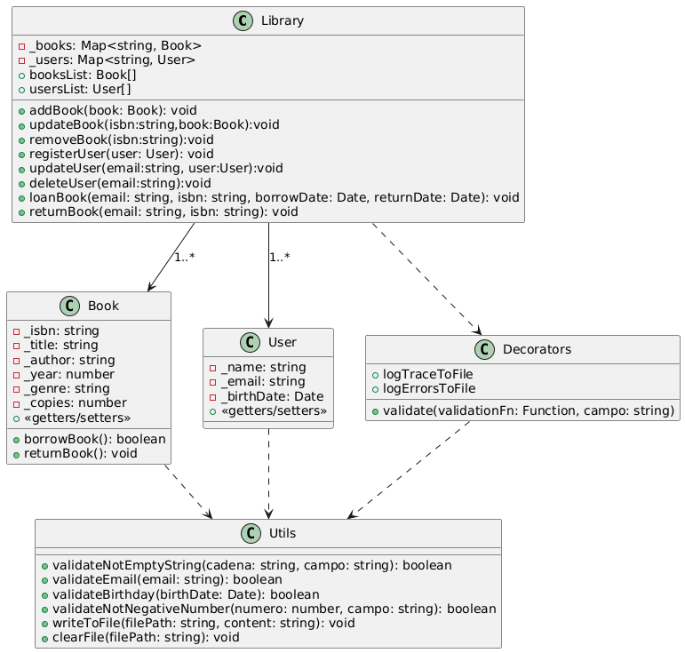

# Biblioteca de Gestión - Aplicación de Préstamos de Libros

Este proyecto implementa una aplicación de gestión de biblioteca que permite gestionar libros, usuarios y préstamos. Se pueden registrar, actualizar, eliminar libros y usuarios, así como realizar préstamos de libros con fechas de préstamo y devolución.

## Características

- **Gestión de libros**: Añadir, actualizar, eliminar y listar libros.
- **Gestión de usuarios**: Registrar, actualizar, eliminar y listar usuarios.
- **Préstamos de libros**: Los usuarios pueden tomar prestados libros y devolverlos.
- **Validaciones**: Validación de entradas de datos, como ISBN, correos electrónicos, fechas, etc.
- **Registro de trazas y errores**: Los eventos del sistema se registran en archivos de traza y errores.

## Tecnologías

- **TypeScript**: Lenguaje principal de desarrollo.
- **Node.js**: Plataforma de ejecución de JavaScript en el servidor.
- **Decoradores**: Utilizados para añadir funcionalidades adicionales a los métodos y validaciones.
- **Archivo de registro**: Trazas y errores se almacenan en archivos `.txt`.

## Requisitos

- Tener **Node.js** instalado en tu máquina.
- Tener **TypeScript** instalado globalmente o en el proyecto.

## Instalación

1. Clona el repositorio:

   ```bash
   git clone https://github.com/DanielCaldes/TypeScript.git
   ```

2. Navega a la carpeta del proyecto:
   ```bash
   cd app
   ```

3. Instala las dependencias del proyecto:

   ```bash
   npm install
   ```

4. Compila el código TypeScript:

   ```bash
   tsc
   ```

5. Ejecuta la aplicación:

   ```bash
   node dist/index.js
   ```

## Uso

### Librería

Puedes interactuar con la librería creando instancias de `Library` para gestionar libros y usuarios. Ejemplo de uso:

```typescript
// Crear una instancia de la librería
const library = new Library();

// Diferentes vistas para gestionar áreas específicas
const bookManager: BookActions = library;  // Vista para gestionar libros
const userManager: UserActions = library;  // Vista para gestionar usuarios
const loanManager: LoanActions = library;  // Vista para gestionar préstamos

// Crear un libro
const book = new Book('978-3-16-148410-0', 'El Gran Libro', 'Autor Desconocido', 2022, 'Ficción', 5);
bookManager.addBook(book); // Usamos la vista de libros para añadir un libro

// Registrar un usuario
const user = new User('Juan Pérez', 'juan@example.com', new Date('1990-05-15'));
userManager.registerUser(user); // Usamos la vista de usuarios para registrar un usuario

// Prestar un libro
const borrowDate = new Date('2025-01-10');
const returnDate = new Date('2025-02-10');
loanManager.loanBook(user.email, book.isbn, borrowDate, returnDate); // Usamos la vista de préstamos para prestar un libro

// Ver el listado de libros y usuarios
console.log(library.booksList);
console.log(library.usersList);
```

### Archivos de Trazas y Errores

Las trazas y los errores se guardan automáticamente en archivos de texto gracias al uso de decoradores. La traza del programa se guardará en `logs/trace_log.txt`, y los errores se guardarán en `logs/error_log.txt`.

Puedes borrar el contenido de estos archivos llamando al método `clearLogFiles()` desde el archivo `utils/logUtils.ts`.

### Validaciones

El proyecto incluye validaciones automáticas mediante decoradores para asegurarse de que los datos ingresados sean correctos, como el formato del correo electrónico, que el ISBN no esté vacío y que las fechas de nacimiento sean válidas.

## Diagrama de Clases

A continuación, se presenta el diagrama UML que ilustra las relaciones entre las clases principales del sistema:



## Decisiones de diseño

El flujo principal del proyecto se encuentra en el archivo index.ts, que actúa como punto de entrada de la aplicación. Este diseño sigue los principios de la programación orientada a objetos (POO) y organiza las funcionalidades en diferentes clases, interfaces y decoradores.

### Clases
Las clases principales están definidas en la carpeta models e incluyen:
- ```Book```: Representa un libro y sus atributos.
- ```User```: Modela a los usuarios del sistema.
- ```Library```: Implementa la lógica central de la aplicación, gestionando libros, usuarios y préstamos.
- ```Loan```: Representa los préstamos realizados en la biblioteca.

Para promover la encapsulación, se utiliza get y set para controlar el acceso a los atributos, asegurando la consistencia y seguridad de los datos.

### Interfaces
Para estructurar y controlar el acceso a los métodos de la clase ```Library```, se han definido las siguientes interfaces:
- ```BookActions```: Permite realizar operaciones relacionadas con los libros.
- ```LoanActions```: Gestiona las acciones sobre préstamos.
- ```UserActions```: Proporciona funcionalidad para la gestión de usuarios.

Estas interfaces permiten especificar los métodos que debe implementar la librería, definiendo una estructura común y garantizando consistencia en su implementación. Además, facilitan el polimorfismo, ya que diferentes clases pueden implementar estas interfaces. Por ejemplo, si se requiriera cambiar la gestión de usuarios a una clase específica, la interfaz aseguraría que la estructura de métodos se mantuviera consistente. Esto también mejora la legibilidad y organización del código, haciendo que sea más fácil de mantener y extender.

### Decoradores
Los decoradores se han implementado para añadir funcionalidades transversales sin modificar directamente el código de las clases o métodos:
- ```ErrorLog```: Captura y registra errores en un archivo de log, mejorando la depuración.
- ```Log```: Realiza un seguimiento de las llamadas a los métodos, registrando datos relevantes para auditoría o análisis.
- ```Validation```: Verifica la entrada de datos, garantizando que cumplan con las reglas del sistema.

### Utilidades
Para mantener los decoradores simples y modulares, las funciones auxiliares necesarias están definidas en la carpeta ```utils```:
- ```LogsUtils```: Centraliza el acceso y gestión de los registros de logs.
- ```ValidationUtils```: Agrupa las validaciones reutilizables para verificar las entradas de datos.


## Estructura del proyecto
```
.
└── app/
│   │
│   ├── dist/                # Directorio generado tras compilar el código TypeScript
│   │
│   ├── node_modules/        # Dependencias instaladas por npm
│   │
│   ├── src/                         # Código fuente del proyecto
│   │   ├── decorators/              # Decoradores personalizados
│   │   │   ├── logErrorToFile.ts    # Decorador de log de traza
│   │   │   ├── logTraceToFile.ts    # Decorador de logs de errores
│   │   │   └── validate.ts          # Decorador de validación
│   │   │
│   │   ├── interfaces/           # Interfaces para gestionar los accesos a Books, Users y Loans
│   │   │   ├── BookActions.ts  # Métodos para gestionar libros
│   │   │   ├── UserActions.ts  # Métodos para gestionar usuarios
│   │   │   └── LoanActions.ts  # Métodos para gestionar préstamos
│   │   │
│   │   ├── models/            # Modelos de datos (clases como Book, User, etc.)
│   │   │   ├── Book.ts        # Modelo de libro
│   │   │   ├── Library.ts     # Modelo de librería
│   │   │   ├── User.ts        # Modelo de usuario
│   │   │   └── Loan.ts        # Modelo de préstamo
│   │   │
│   │   ├── utils/                  # Interfaces para gestionar los accesos a Books, Users y Loans
│   │   │   ├── LogUtils.ts         # Funciones auxiliares para escribir en los txt o limpiarlos
│   │   │   └── ValidationUtils.ts  # Funciones auxiliares para validar la entrada de datos
│   │   │
│   │   └── index.ts         # Punto de entrada principal de la aplicación
│   │ 
│   ├── package.json         # Archivo de configuración de npm
│   │
│   ├── package-lock.json    # Archivo de bloqueo de dependencias
│   │
│   └── tsconfig.json        # Configuración de TypeScript
│
└── README.md            # Documentación de github del proyecto
```
